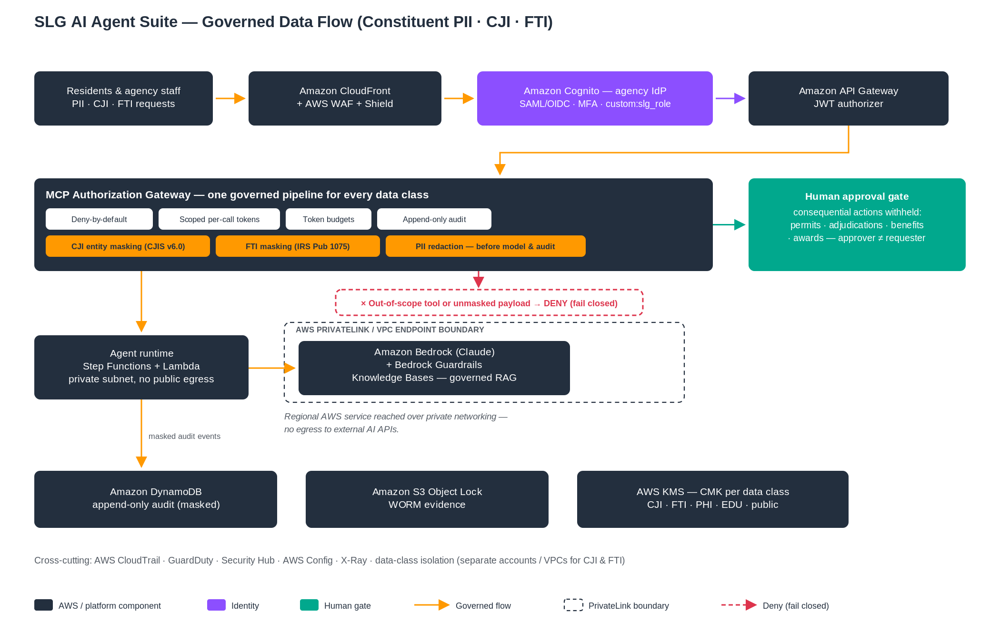

# SLG AI Agent Suite
### Governed AI Agents for State & Local Government — Built on AWS

> **The agent is not the product. The governance that makes it deployable, auditable, and compliant in a regulated government environment is.**

A **reference accelerator** of **8 governed SLG AI agents** — each with a **standalone reference architecture** (own VPC, identity, data, and audit stack) — plus an **optional Whole-of-Government orchestration platform** that coordinates them across agencies. A no-API-key automated test suite — including new negative-case tests for bound approvals, cryptographic JWT verification, append-only audit, and fail-closed masking — exercises the governance and control-plane logic. Grounded in current AWS and SLG sources (`SOURCES.md`, `decks/DECK-SOURCES.md`).

> **Status & maturity (read first).** This is a **reference accelerator for discovery, architecture workshops, and scoped pilots — not an AWS-authorized, production-ready system.** **All 8 agents are now one-command deployable golden paths** (SAM) under `infra/golden-path-*/`; Resident Services / 311 is the fully-documented reference the others mirror. These golden paths are **deployable, governed workflow skeletons** (the HTTP tool route is enforced through the policy/approval/token/audit gateway; the Step-Functions agent functions now reason with Bedrock + ground via governed RAG, with a deterministic fallback for offline/CI). **all 8 agents now execute their consequential write *through* the governed gateway** — policy + bound approval + scoped token + append-only audit, proven by 19 workflow tests; **all 8 agents now draft via Bedrock + the deployed Guardrail and ground via governed RAG** (a Retrieve step calls `kb.search_policy` through the gateway — an audited read — backed by a Bedrock Knowledge Base in live mode; deterministic fallback for offline/CI); the **human gate is served by a real authenticated reviewer service** (verified-JWT reviewer, authority + separation-of-duties + single-use, server-side bound-token minting, Step Functions resume, audited — `GET/POST /approvals`). **Every agent now ships a secure combined deploy** (`infra/golden-path-*-secure/`) that stands up the secure baseline (in-VPC Lambdas, PrivateLink endpoints, customer-managed CMK, S3 Object-Lock WORM, CloudFront/WAF) **and** the full governed app in one `sam deploy`. **All 8 golden paths have now been deployed to a real AWS account (us-east-1), runtime-verified, and torn down** — see the "Deployed & validated on AWS" section below. Live system-of-record connectors are the remaining tracked delivery phase. Live connectors, production identity, security testing, and an authorization (ATO / StateRAMP / FedRAMP) are customer-engagement work. See `docs/PRODUCTION-READINESS-AND-SHARED-RESPONSIBILITY.md` (gap assessment + RACI) and `docs/REPO-REVIEW-AND-REMEDIATION-PLAN.md` (independent review, verified findings, and the gap-closure plan currently in progress).

---

### Canonical deployment path

**The one supported deploy path is the 8 per-agent SAM golden paths under [`infra/golden-path-*/`](infra/GOLDEN-PATHS.md)** (`sam build && sam deploy` + smoke test + teardown per agent) — all 8 were deployed to a live AWS account, runtime-verified, and torn down. The `infra/golden-path-*-secure/` variants are the **hardened option** (secure baseline + app in one deploy; not yet live-validated as a combined stack), and [`infra/terraform/`](infra/terraform/) and the shared [`infra/cloudformation/`](infra/cloudformation/) stack set are **reference material**, not supported deploy paths. Validation evidence for the canonical path: [`evidence/CLEAN-ACCOUNT-ACCEPTANCE.md`](evidence/CLEAN-ACCOUNT-ACCEPTANCE.md).

## ▶ Start here — what to read first
**New to this repo, read in this order:**
1. **This README** — the need, the solution, the regulations, and who owns what.
2. **`docs/REPO-REVIEW-AND-REMEDIATION-PLAN.md`** — an independent review with **verified findings** and the gap-closure status. **P0–P4 are closed:** claims aligned to reality, **all 8 agents wired as one-command golden paths**, the **control plane hardened** (bound/single-use approvals, JWT verification, append-only audit, scoped IAM, fail-closed masking — all unit-tested), a full **security package**, and a **CI security pipeline**.
3. **`docs/PRODUCTION-READINESS-AND-SHARED-RESPONSIBILITY.md`** — honest gap assessment + RACI (read before any production decision).
4. **`infra/GOLDEN-PATHS.md`** — deploy any agent in one command (`sam build && sam deploy` → `./smoke_test.sh`); 311 walk-through in `infra/golden-path-311/DEPLOY-GOLDEN-PATH.md`.

**I want to…**
- **See it / pitch it** → `decks/` (10 narrative decks) + `decks/leave-behinds/` (one-pagers) + `gtm/SELLER-SA-FIELD-GUIDE.md`.
- **Deploy the golden path** → `infra/golden-path-311/` (SAM, one command + smoke test + teardown).
- **Review the security model** → §3 + the CIO/CISO/Architect section, then the **security package**: `SECURITY.md`, `docs/THREAT-MODEL.md`, `docs/NIST-800-53-CONTROL-MATRIX.md`, `docs/OWASP-LLM-ATLAS-MAPPING.md`, `docs/INCIDENT-RESPONSE-AND-KEY-MANAGEMENT.md`.
- **Run the tests** → `pytest` (no API key needed; control-plane negative-case tests). Cloud proof: `docs/RELEASE.md` (ephemeral-AWS **authenticated-API negative tests** + tagged release `v0.1.0`).

---

## ✅ Deployed & validated on AWS
All 8 golden paths were deployed to a live AWS account (`us-east-1`), verified at runtime, and torn down. This is a real deployment check, not a claim — it caught two bugs that `cfn-lint` and the offline suite did not.

**Results**
- **All 8 stacks reached `CREATE_COMPLETE`** (`slg-311` + `slg-02…08`), deployed in parallel via SAM.
- **Resident Services / 311 ran end-to-end on real infrastructure:** Classify → Retrieve → Draft → Check → **paused at the human gate** (`waitForTaskToken`), and the governed `kb.search_policy` retrieval wrote an **append-only audit record** to DynamoDB — proving the layer, the workflow Lambdas, and the governed read all work as deployed.
- **Cross-agent runtime confirmed** on agent 04 (Benefits/HHS): same Classify → Retrieve → Draft path, clean.
- **Teardown verified:** all stacks plus the `Retain`-policy resources they leave behind (audit + pending-approval tables, Cognito user pools, Bedrock guardrails, log groups) were removed; a final sweep showed **zero `slg-*` resources** across CloudFormation, DynamoDB, Cognito, Bedrock, Lambda, Step Functions, and CloudWatch Logs.

**Two real bugs found and fixed (now in the repo)**
1. **Bedrock Guardrail** rejected `PROMPT_ATTACK` with `OutputStrength: HIGH` — that filter applies to input only, so output strength must be `NONE`. Corrected in all 16 golden-path templates and `infra/cloudformation/security.yaml`.
2. **Lambda path resolution:** the workflow Lambdas computed `Path(__file__).resolve().parents[3]` to find sibling repo dirs, which throws `IndexError` in Lambda's flat `/var/task` layout (those modules are provided by the shared layer there). Guarded in all per-agent `_shared.py` / `check.py`; the offline suite (124 tests) still passes.

**Deploy prerequisites / gotcha**
- The `SharedLayer` uses a **Makefile build** (`sam build` needs `make` on PATH). On a host without `make` (e.g. stock Windows), either install `make`, or pre-assemble the dependency-free layer (`platform_core/slg_agent_platform` + `governance` + the agent's `core.py` → `layer/python/`) and deploy a template variant that drops the Makefile metadata. A future cleanup is to switch the layer to a `python3.12` build method to remove the `make` dependency.
- Deploy in `us-east-1` for the secure variants (the CloudFront-scoped WAF must live there).

---

## Capability maturity matrix

✅ = evidence in this repo (code + tests, or the documented live AWS validation) · ◻ = not done here / engagement work.
Live-AWS cells reflect the 2026-06-30 validation-account run (all 8 golden paths deployed, runtime-verified, torn down — stacks `slg-311-deploytest`, `slg-02…08-deploytest`; see **Deployed & validated on AWS** above).

| Capability | Designed | Implemented (offline/tested) | Deployed on AWS (validated) | Integration-tested on AWS | Production-ready | Owner (Repo/Customer) |
|---|:--:|:--:|:--:|:--:|:--:|---|
| Identity / authN | ✅ | ✅ | ✅ | ✅ | ◻ | Repo (Cognito JWT authorizer; enterprise IdP federation: Customer) |
| MCP / tool authorization gateway | ✅ | ✅ | ✅ | ✅ | ◻ | Repo |
| Policy enforcement (deny-by-default) | ✅ | ✅ | ✅ | ✅ | ◻ | Repo |
| Human approval (SoD, single-use) | ✅ | ✅ | ✅ | ✅ | ◻ | Repo (`waitForTaskToken` gate exercised live) |
| PII/PHI masking | ✅ | ✅ | ◻ | ◻ | ◻ | Repo (fail-closed masking unit-tested; not runtime-verified on AWS) |
| Audit (append-only + WORM) | ✅ | ✅ | ✅ | ✅ | ◻ | Repo (append-only audit written live; WORM ships in the `-secure` variants, not runtime-validated) |
| Bedrock + Guardrails | ✅ | ✅ | ✅ | ✅ | ◻ | Repo |
| IaC deploy (golden path) | ✅ | ✅ | ✅ | ✅ | ◻ | Repo (all 8 golden paths) |
| Live connectors | ✅ | ✅ | ◻ | ◻ | ◻ | Customer (fixtures here; live system-of-record connectors are the tracked delivery phase) |
| CI/CD | ✅ | ✅ | ◻ | ◻ | ◻ | Repo (CI security pipeline; no cloud deploys in CI) / Customer |
| Monitoring / alerts | ✅ | ◻ | ◻ | ◻ | ◻ | Customer |
| DR / backup | ✅ | ◻ | ◻ | ◻ | ◻ | Customer |
| Compliance evidence | ✅ | ✅ | ◻ | ◻ | ◻ | Repo (NIST 800-53 matrix, security package) / Customer (ATO/StateRAMP evidence) |

Nothing in this repository is production-certified; see [`docs/PRODUCTION-READINESS-AND-SHARED-RESPONSIBILITY.md`](docs/PRODUCTION-READINESS-AND-SHARED-RESPONSIBILITY.md)  for the full RACI.

*Governance once, agents as add-ons: `platform_core` (`slg-agent-platform` 0.1.0) **implements the Aegis Governance Pattern (AGP) v1.0** — the shared governance contract defined in the Aegis platform repo (`docs/14-GOVERNANCE-PATTERN-VERSIONING.md`). Conformance is declared in `platform_core/slg_agent_platform/__init__.py` (`AEGIS_GOVERNANCE_PATTERN_VERSION`) and asserted by `platform_core/tests/test_agp_conformance.py`.*

> **Validation update (2026-07-07).** The 2026-06-30 eight-golden-path deployment was independently re-verified against the validation account (CloudTrail `ExecuteChangeSet`/`DeleteStack` events, deleted-stack history; actual stack names used the `-deploytest` suffix). `TokenSecret` no longer has a development default in any template. Sanitized proof pack: [`evidence/CLEAN-ACCOUNT-ACCEPTANCE.md`](evidence/CLEAN-ACCOUNT-ACCEPTANCE.md).

---

### Hero pilot — Resident Services / 311 (real connector + scored quality benchmark)

**Resident Services / 311 is the lead, low-blast-radius pilot** (read-mostly, public data, no irreversible action), and it now goes beyond fixtures with a **REAL read-only connector to live public data**:

- **Real connector** — `platform_core/slg_agent_platform/connectors/nyc311.py` reads the **NYC 311 Service Requests** dataset on NYC Open Data (Socrata, public, no auth). It is **stdlib-only, timeout-bounded, fail-closed, and READ-ONLY**: `get_service_request` / `search_requests` / `search_duplicates` read real requests through the **deny-by-default MCP gateway** (role `RESIDENT_SERVICES_AGENT`), every call is **PII-masked and audited**, and both write methods (`create_service_request` / `update_service_request`) raise — opening or mutating a real 311 case stays **human-gated to the city's own system**. Enable with `CONNECTOR_MODE=live CRM311_SOURCE=nyc311`; the default fixture path is unchanged.
- **Offline + live demo** — `01-resident-services-311/demo/demo_nyc311.py` runs the whole governance story against real data (governed read → fail-closed PII masking → governed duplicate search → human-authority boundary: create is **gated**, update is **withheld**). Live by default, or `NYC311_OFFLINE=1` for a cassette-backed run with graceful fallback.
- **Scored quality benchmark, gated in CI** — `governance/evals/score_311.py` measures the real connector pipeline against a labeled 311 benchmark (`golden/agent01_311_scored.json`, reproducible via `gen_golden_311.py`) with regulatory-weighted thresholds: complaint-type classification accuracy (≥ 0.90), entity F1 (≥ 0.85), duplicate accuracy (≥ 0.90), grounding rate (≥ 0.90, reusing `governance/grounding.py`), field completeness (≥ 0.95), and a **PII-leak hard gate (= 0)** using the platform masker. Negative-control tests prove the gate has teeth. `make eval-311` runs it locally; a CI **`evals`** job runs it deterministically (no API key) and publishes `eval-report-311.md`.

Honest framing: NYC 311 Open Data is a genuine public **read** source used as a reference. The production write path into the agency's own 311/CRM (authenticated, transactional) and a production-hardened connector remain **customer-engagement work**.

---

## 1. The need — what state & local government actually faces
AI is **NASCIO's #1 state-CIO priority for 2026**, yet **90% of states are stuck in pilots and only 25% have dedicated GenAI funding** (NASCIO). Residents experience government as fragmentation; agencies experience AI as ungoverned sprawl — a chatbot per agency, each a separate integration, security review, and audit. **The blocker is not the model.** It is identity, authorization, audit, data-class isolation, accessibility, and *which agency has the authority to act*.

The pain is specific, documented, and expensive:

| Workflow | The pain today (cited) |
|---|---|
| Public records / FOIA | National backlog **267,056 requests (+33%)**, **$723.4M** government-wide cost (DOJ OIP, FY2024) |
| Benefits / HHS | **69%** of Medicaid "unwinding" disenrollments were **procedural**, not ineligibility (KFF); benefits call centers **25-min waits, 29% abandonment** (CMS) |
| Permitting | Permitting friction ≈ **one-third** of the home price-vs-cost gap (Soltas & Gruber, MIT/Princeton, 2026) |
| Case intake / forms | A single complex intake took **45+ minutes** to summarize and route (Anne Arundel County) |
| IT service desk | A live contact costs **~$8** vs **~$0.10** self-service; only **9%** of people self-resolve today (Gartner) |
| Resident services | Residents navigate **dozens of departments** with no single front door |

---

## 2. How this solves it
**8 governed agents**, each a runnable workflow (intake → classify → gather evidence → draft → compliance check → **human gate** → finalize), every system touch flowing through a deny-by-default authorization gateway:

| # | Agent | What it does | Documented gain (cited; vendor-reported where noted) |
|---|---|---|---|
| **01** | Resident Services & 311 | Right service, cited answers, gated 311 actions | Live contact **$8.01 → $0.10** (Gartner); **~20%** of 311 interactions / **45%** peak staffing cut (Denver "Sunny") |
| **02** | Forms & Document Processing | Extract, validate, assemble official forms | **45 min → <20s** (Anne Arundel, AWS); **~1%** baseline manual key-entry error (JAMIA, peer-reviewed) |
| **03** | Permitting & Licensing | Code pre-check, flag, structured review | Permitting **"weeks and months → hours and days"** (State of California, 2025, *gov*); **~50%** zoning review (Austin) |
| **04** | Benefits / HHS Caseworker | Prescreen, evidence, notices | SNAP error **10.93%** (USDA, *gov*); appeal ruling **minutes vs. hours** (Nevada DETR) |
| **05** | Public Records / FOIA | Search, classify, propose redactions, package | Backlog **267,056** / **$723.4M** cost (DOJ, *gov*); records search **hours → seconds** (Kofile, AWS) |
| **06** | Procurement & Grants | Draft solicitations, organize bid evidence | **57-day** avg RFP cycle (Euna); **$6.8B** inefficiencies flagged / all spend reviewed in **60 days** (Oklahoma OMES, *named state*) |
| **07** | GovOps IT Service Desk | Triage, tickets, runbooks, modernization | **75%** queries self-resolved (IBM AskIT); MTTR **>10%** (ServiceNow ITSM AI/ML) |
| **08** | Public Safety / Public Health | Summaries, reports, validated surveillance | Cooling-tower ID **−98%**, 4 hr → 5 min (CDC, ***gov + peer-reviewed***); report time **−61%** (Leon County) |

> Numbers are documented results from named deployments and published benchmarks; every figure is labeled by evidence tier on-slide (**[GOV] / [PEER-REVIEWED] / [VENDOR-REPORTED] / [ANALYST]**). Counter-evidence and caveats — e.g. the peer-reviewed **null-result RCT** on AI police-report writing — live in the **speaker notes** for presenters to volunteer. The unvalidated Honolulu permitting figure was removed and replaced with the [GOV] State-of-California source. Full citations: `decks/DECK-SOURCES.md`.

**The five controls that make it deployable** (this is the product):
1. **Deny-by-default gateway, least-privilege intersection** — `permitted ⇔ agent grant ∩ user entitlement`; the agent can never exceed the employee it acts for. **The deployed HTTP tool route runs *through* this gateway inside the connector Lambda** (policy → bound approval → scoped token → append-only audit, identity from the JWT authorizer only) — not a bypass.
2. **Consequential actions withheld in code** — issue-permit / adjudicate / release-records / award are *absent from the agent's grants*, enforced by a passing test. A human owns them.
3. **Framework-enforced human gate** — `interrupt_before` / Step Functions `waitForTaskToken`; no code path commits without approval.
4. **Tamper-evident audit + WORM** — append-only DynamoDB + S3 Object Lock; PII/CJI/FTI masked at every boundary.
5. **Private Bedrock connectivity** — Bedrock reached over **AWS PrivateLink (VPC endpoint)** so API traffic avoids the public internet, with **mandatory Guardrails**. (The model runs in the Bedrock regional service, not inside your VPC; data-residency is governed by region + your controls.)

Plus the **Whole-of-Government Orchestration Platform** (`gov_platform/wog_orchestration/`) — see `ENTERPRISE-PLATFORM.md` — and five documented future use cases (`docs/FUTURE-USE-CASES.md`).

---

## 3. How it satisfies the regulations & security architecture

### Secure MCP gateway — how every tool call is authorized

Every agent tool call passes through an **authenticated gateway**; there is no un-gated path to a system of record. The same controls apply everywhere in the portfolio (the [Aegis Governance Pattern](the Aegis platform repo `docs/14-GOVERNANCE-PATTERN-VERSIONING.md`)):

- **Inbound authorization — JWT or IAM.** A verified Cognito/IdP **JWT** (or SigV4/**IAM**) is required on every call; identity is taken only from the verified authorizer claim, never the request body. *"No authorization" is a development/testing mode only and is never used in production.*
- **Deny-by-default policy.** A tool is callable only if it is **registered in the allow-list** and the caller's effective permission = **grant ∩ entitlement** (the agent can never exceed the human it acts for). Unregistered tool or out-of-scope data class → **deny**.
- **Human approval for consequential actions.** Consequential tools are **withheld in code** and require a **bound, single-use, separation-of-duties** approval (approver ≠ requester; replay rejected).
- **Scoped outbound authorization.** The gateway issues **short-lived, least-privilege** downstream credentials (IAM / OAuth / token-exchange / on-behalf-of), so "the agent acts only within the human's authority" holds end to end.
- **Fail-closed masking.** PII / CJI / FTI data is masked before any model or audit write; on masker failure it **redacts rather than leaks**.
- **Append-only audit + revocation.** Every decision (allow / deny / approval) is written to an **append-only** sink (IAM denies `UpdateItem`/`DeleteItem`) with **WORM** evidence; tools can be revoked / deny-listed at the registry.
- **Failure modes are fail-closed.** Missing/invalid token → **401**; unregistered tool → **deny**; missing approval → **deny**; masker or audit-write failure → **deny, not proceed**.

In deployment this is **Amazon Bedrock AgentCore Gateway** (managed) or the **portable API-Gateway-+-Cognito-JWT** path; the portable path is the supported default and the one live-validated (the Aegis platform repo, Run 10; the same portable pattern deploys here).

> **Auditors / GRC reviewers:** the [`assurance/`](assurance/README.md) packet is a single
> curated cover sheet indexing every threat-model, NIST/CJIS/IRS-1075 control-mapping, evidence,
> and shared-responsibility artifact under standard assurance headings.



The shared Aegis control-plane pattern — how every tool call is authenticated, authorized, human-approved, and audited, including the deny paths:


Editable source: the SVG in [`docs/diagrams/`](docs/diagrams/) (open in draw.io, Inkscape, or any text editor).

**A complete AWS architecture, edge to data tier** (see any deck's architecture slide and `docs/SUITE-ARCHITECTURE.md`):

```
Residents/staff -> CloudFront + AWS WAF (OWASP managed rules, rate-limit) + Shield
   -> API Gateway/ALB . Amazon Cognito (federates agency IdP -> short-lived JWT; API GW JWT authorizer)
   -> Agent runtime (Step Functions + Lambda, or AgentCore Runtime) in a private subnet
   -> MCP authorization gateway (re-validates JWT + custom:slg_role claim; mints a scoped per-call token)
   -> Amazon Bedrock (Claude) + Guardrails via VPC endpoint   [no PII egress]
   -> DynamoDB append-only audit . S3 Object Lock (WORM) . KMS CMK per data class
Cross-cutting: CloudTrail . GuardDuty . Security Hub . Config . X-Ray . data-class isolation (CJI/FTI/PHI/EDU/public)
```

**Control → regime mapping** (full matrix: `docs/COMPLIANCE-CONTROL-MAPPINGS.md`, machine-readable in `governance/controls/control_mappings.py`):

| Regime | How it's addressed |
|---|---|
| **GovRAMP / FedRAMP** | Deploy on AWS authorized regions (GovCloud High / US Moderate) |
| **CJIS Security Policy v6.0** | CJI account/VPC isolation; deny-by-default gateway; scoped tokens; masked audit |
| **IRS Pub 1075 (FTI)** | FTI isolation + masking; KMS; access logging; WORM retention |
| **HIPAA / MARS-E → ARC-AMPE** | PHI masking; deterministic eligibility engine **outside** the LLM; least privilege |
| **FERPA / DPPA** | Security-trimmed retrieval; consent; driver's-license masking; purpose-bound scopes |
| **ADA Title II / WCAG 2.1 AA** | Accessibility checks on AI output in CI (deadlines Apr 2027 / Apr 2028) |
| **NIST AI RMF** | Grounding, prompt registry, evals, red team, fairness, HITL gates |
| **PCI DSS** | Card masking (Luhn); none in prompts/audit; tokenized payment connector |

Each control is marked **Implemented** (in the platform) vs **Configurable** (the customer wires their IdP, validates connectors, sets Guardrail policy and retention schedule, and owns ATO/GovRAMP and CSV for the intended use). The **CISO security-review checklist** is in `gtm/SELLER-SA-FIELD-GUIDE.md` §6, and the full ownership split is in §5 below.

---

## 3a. For the CIO, CISO & Director of Architecture — why this clears review
The shared concern: **an AI agent that can touch systems of record is a governance, audit, and least-privilege problem before it is a model problem.** This accelerator is built around exactly that, and the controls below are implemented and unit-tested (not just described) — see `docs/REPO-REVIEW-AND-REMEDIATION-PLAN.md`.

**CISO — security & compliance concerns, and how they're alleviated**

- *"Could the AI take a consequential action on its own?"* No. Every consequential action (issue permit, adjudicate, release records, award) is **withheld from the agent in code** and verified by tests; it executes only after a **bound, single-use, separation-of-duties** human approval (approver ≠ requestor; the approval token is cryptographically bound to the exact tool and arguments, expires, and cannot be replayed or retargeted).
- *"Can I trust the identity and roles?"* Identity is **cryptographically verified** (RS256 over the Cognito JWKS, with issuer/audience/expiry checks and an alg-confusion guard); client-supplied roles are never trusted. Authorization is **deny-by-default with least privilege as an intersection** — the agent can never exceed the employee it acts for.
- *"Will the audit trail hold up?"* The audit store is **append-only by enforcement** (PutItem-only IAM with an explicit Update/Delete deny + conditional writes), with **WORM (S3 Object Lock)** retention keyed to data classification, and **PII/CJI/FTI masking that fails closed**. Every tool attempt — allow, deny, pending-approval, error — is recorded with lineage.
- *"Where does the data go?"* Inference stays **in-account** (Amazon Bedrock via VPC endpoint) with **Guardrails on input and output**. Maps to **CJIS v6.0, IRS Pub 1075, HIPAA/ARC-AMPE, NIST AI RMF, ADA Title II** (§3); the CISO security-review checklist is in `gtm/SELLER-SA-FIELD-GUIDE.md` §6.

**Director of Architecture — design & operational concerns**

One governed pattern, reused across eight agents: edge (CloudFront + WAF + Shield) → Cognito JWT → API Gateway → MCP gateway (deny-by-default + scoped per-call token) → Bedrock + Guardrails → human gate → append-only WORM audit. CloudFormation/SAM is the **canonical, validated IaC** (Terraform is a reference skeleton, not at parity — see [`docs/TERRAFORM-AND-GOVCLOUD-STATUS.md`](docs/TERRAFORM-AND-GOVCLOUD-STATUS.md); GovCloud is a design-time overlay), **per-function least-privilege roles** (Bedrock scoped to the model + guardrail ARNs, no `Resource:"*"`), and **one fully-wired golden path** (`infra/golden-path-311/`) deployable with `sam build && sam deploy`, with a smoke test and teardown. Readable Python and standard AWS services — no black box, no lock-in.

**CIO — ROI & risk concerns**

Build the governance once and every future agent inherits it — the way out of the **"90% piloting / 25% funded"** trap (NASCIO). Start with a low-blast-radius agent (311 or IT service desk), prove value against documented outcomes (§2), and scale on a paved road to funded, compliant production. The **honest gap assessment** (§5) and the verified remediation plan mean no surprises in security review.

Monthly run-cost model (pilot vs production): [`offerings/TCO-MODEL.md`](offerings/TCO-MODEL.md)

**What we deliberately do *not* claim:** it is not yet AWS-authorized or ATO/StateRAMP-certified, and live connectors + third-party security testing are engagement work. That candor — plus the verified, tested control plane — is what makes the rest credible to a review board.

> **For assessors:** the **security package** — `SECURITY.md`, `docs/THREAT-MODEL.md` (trust boundaries + abuse cases), `docs/NIST-800-53-CONTROL-MATRIX.md` (control-by-control, with evidence/test/owner), `docs/OWASP-LLM-ATLAS-MAPPING.md`, and `docs/INCIDENT-RESPONSE-AND-KEY-MANAGEMENT.md` — maps every claim above to a testable control or a named owner.

---

## 4. How to position it
- **Standalone first, platform when ready.** Each agent deploys standalone via its canonical golden path (`infra/golden-path-*/`, SAM) with **no WoG dependency**; the per-agent CloudFormation stack set (`scripts/deploy.sh <agent>` — own VPC, CloudFront+WAF edge, Cognito JWT, KMS, WORM audit, gateway, agent) is the scale-out reference (`docs/DEPLOYMENT-MODELS.md`). Grow agent by agent; the WoG platform is additive.
- **Sellers & SAs start here:** `gtm/SELLER-SA-FIELD-GUIDE.md` (9-phase playbook) and the one-page `gtm/SELLER-FIRST-MEETING-CHEATSHEET.md`.
- **Decks (one location, `decks/`):** 8 per-agent narrative decks + the WoG platform deck + a suite executive overview — each a 6-slide arc (hook → problem → governed solution pipeline → **true AWS architecture & traffic-flow diagram** → tradeoffs/results) with a full **TIMING + talk-track in the speaker notes** and grounded, cited figures.
- **Pitch narrative & objection handling:** `gtm/WOG-PLATFORM-GTM-STORY.md`.

---

## 5. Production readiness — and who owns what (read before any production decision)
**Honest status: this is a production-shaped accelerator, not an authorized, production-ready system — and it doesn't claim to be.** That honesty is the point: it embeds the governance controls usually retrofitted, which de-risks the path to production, but real work remains and most of it is the customer's.

**Why it gives confidence (verifiable today):** consequential actions withheld in code + tested · framework-enforced human gate · deny-by-default least-privilege · WORM audit + masking · complete AWS security architecture mapped to your regimes · no lock-in (readable Python, CFN + Terraform) · a no-API-key test suite incl. new control-plane negative-case tests (approval binding, JWT verification, append-only audit, fail-closed masking).

**What still must be built/authorized before go-live (stated plainly):**
- **Integrations are fixtures** — there are **no live connectors** yet to 311/CRM, eligibility systems, Accela/Tyler, ECMS, ServiceNow, etc. Each must be built and validated (usually the largest line item).
- **No ATO / GovRAMP authorization** and **no third-party security testing** (pen test, threat model). The Python gateway is a *reference model* of the authorization; the production AgentCore Gateway / API Gateway + Cedar authorizer must be tested, not just the analog.
- **Model-risk validation**, Guardrail/red-team tuning against your data, accessibility (axe-core + manual), DR game day, IdP integration, retention schedule, and **HITL queue staffing** are customer-owned engagement work.

**Who owns what (RACI summary — AWS · Delivery Partner · Customer):** AWS owns the authorized cloud; the **Delivery Partner** builds connectors, configures, tests, and extends; the **Customer (agency)** owns data classification, IdP, ATO/GovRAMP, model-risk validation, retention, and day-2 operations.

> **Full detail:** `docs/PRODUCTION-READINESS-AND-SHARED-RESPONSIBILITY.md` — the gap assessment, the 24-row shared-responsibility (RACI) matrix, a gated go-live checklist, and a phased path (start with a low-blast-radius agent like Resident Services or IT service desk; **not** Benefits or Public Safety first).

---

## What this is — and what it is not
| This is | This is not |
|---|---|
| A governed, auditable **accelerator** with the hard controls built in | A certified, validated, ATO'd SaaS product you deploy unchanged |
| A reference architecture + IaC you deploy into your account and **own** | A black-box dependency or a turnkey integration |
| Decision-support — drafts, assembles, routes, flags — humans decide | Autonomous decisioning in regulated workflows |
| Demonstrated + deployable-by-design (no-API-key tests incl. control-plane negative cases) | Production-ready until the go-live checklist is met |

## Repository map
```
README.md  ENTERPRISE-PLATFORM.md  SUITE-STATUS.md  SOURCES.md
01-resident-services-311/ ... 08-public-safety-health/   # 8 agents (code, tests, docs, deploy runbook)
platform_core/slg_agent_platform/                        # gateway, masker, LLM factory, connectors, A2A
gov_platform/wog_orchestration/                          # Whole-of-Government: govern, canonical, consent, saga, events
governance/                                              # grounding, prompts, evals, red team, fairness, accessibility, controls
aws-native-reference/                                    # Strands + Step Functions rebuilds (per agent + WoG saga)
infra/cloudformation/  infra/terraform/                  # IaC: edge, network, security, data, gateway, agent, wog-platform (commercial + GovCloud)
docs/                                                    # architecture, compliance mappings, deployment models, PRODUCTION-READINESS, why-the-MCP-layer
gtm/                                                     # seller/SA field guide, first-meeting cheat-sheet, WoG GTM story
decks/                                                   # 10 customer decks (talk track in speaker notes) + DECK-SOURCES.md
runbooks/                                                # deploy (platform), incident, DR, model-degradation, HITL queue
```

## The eight agents (detail)
Each agent ships: a runnable workflow (per-intent action mapping), gateway-backed tools, a test suite, a README + four-document set, **a step-by-step AWS deploy runbook** (`<agent>/docs/DEPLOY-RUNBOOK.md`), a customer deck (`decks/`), and an AWS-native Strands/Step Functions rebuild. Deliberate omissions are a feature — the legally consequential commit actions are withheld from the agents in code and verified by tests.

## Shared platform (`platform_core/slg_agent_platform/`)
MCP authorization gateway (deny-by-default, least-privilege intersection, HITL gate, scoped tokens, PII/CJI/FTI-masked append-only audit) · the masker · LLM factory (in-account Bedrock + Guardrails) · connector framework (fixture/live) · A2A supervisor.

## Governance & evaluation (`governance/`)
Grounding verification · prompt registry (hash-pinned, drift-failing CI) · eval harness · red team · fairness (four-fifths) · **accessibility (WCAG/ADA Title II)** · compliance control mappings · HITL-enforced tests. All run with no API key.

## Whole-of-Government Orchestration (`gov_platform/wog_orchestration/`)
Govern-tool-access contract · canonical data + adapters · AAL-gated consent ledger · durable **saga with compensation** · compliance event bus + evidence · **5 life-events live** (moving, job_loss, new_business, disaster, bereavement). Runnable: `aws-native-reference/wog-platform/local_runner.py`. The platform story: `ENTERPRISE-PLATFORM.md`.

## Deployment models — standalone first, platform when ready
Every agent deploys **standalone** with **no WoG dependency** — canonically via its SAM golden path (`infra/golden-path-*/`); the shared stack set (`edge.yaml` CloudFront + WAF + Shield · `network.yaml` own VPC + Flow Logs + Bedrock endpoint · `security.yaml` KMS + Guardrail + Cognito · `data.yaml` append-only audit + S3 Object Lock WORM · gateway · agent) is the scale-out reference. Adopt the WoG orchestration layer later, agent by agent; the same agents become saga steps unchanged. CloudFormation + Terraform, commercial **and** GovCloud. See `docs/DEPLOYMENT-MODELS.md`.

## Go-to-market & deploy assets
`gtm/SELLER-SA-FIELD-GUIDE.md` (seller/SA playbook) · `gtm/SELLER-FIRST-MEETING-CHEATSHEET.md` (one-pager) · `gtm/WOG-PLATFORM-GTM-STORY.md` (pitch, personas, objection Q&A) · `docs/PRODUCTION-READINESS-AND-SHARED-RESPONSIBILITY.md` (gap assessment + RACI) · `runbooks/WOG-PLATFORM-DEPLOYMENT-RUNBOOK.md` (16-stage architect deploy) · per-agent `docs/DEPLOY-RUNBOOK.md` · ops runbooks · decks (`decks/`).

## Quick start
```bash
pip install -e platform_core
PYTHONPATH=platform_core:. python -m pytest platform_core/tests governance gov_platform/wog_orchestration/tests -q   # green, no API key
cd 01-resident-services-311 && EXTRACT_MODE=demo python demo/demo_run.py
PYTHONPATH=platform_core:. python aws-native-reference/wog-platform/local_runner.py   # 5 life-events + a rollback
```

## Compliance disclaimer
A **decision-support accelerator** for qualified government staff — not a certified system, an ATO, or an approved adjudication tool. AI-generated content requires human review before any consequential action; the AI never takes irreversible action autonomously. Customers own ATO/GovRAMP, IdP integration, connector validation, Guardrail configuration, retention schedule, and CSV for the intended use. See `docs/PRODUCTION-READINESS-AND-SHARED-RESPONSIBILITY.md`.